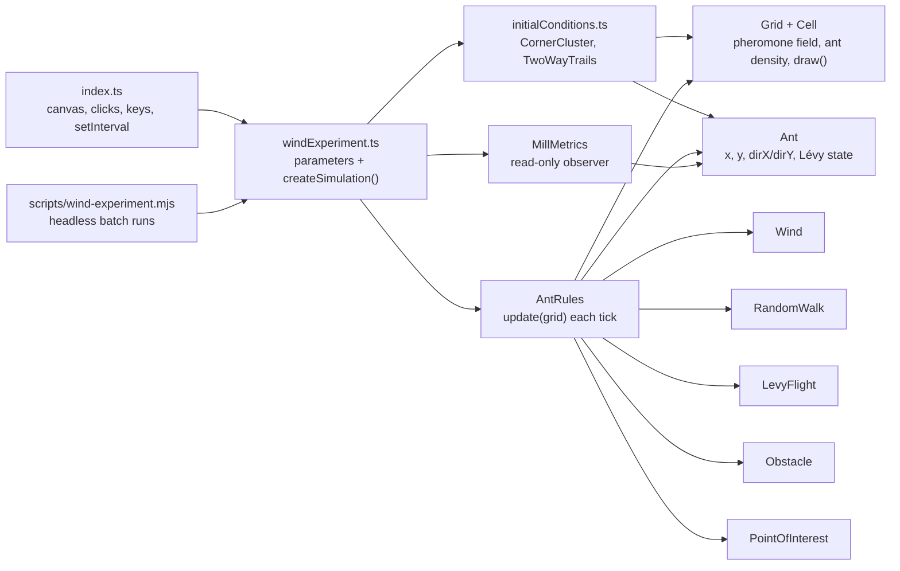

# automato

A TypeScript + Canvas ant-colony simulation. Ants forage toward a point of
interest, lay pheromone as they go, and — when an obstacle blocks the way —
can lock into the rotating **ant mill** ("death spiral") described in Li &
Chen's paper on memory-reinforcement systems.

The page currently opens on an experiment that asks whether **wind blowing
the pheromone trails around can make an ant mill emerge on its own** — see
[The wind experiment](#the-wind-experiment).

## Running it

```
npm run dev         # start the Vite dev server
npm run build       # production build
npm run preview     # preview the production build
npm run format      # prettier --write src
npm run experiment  # headless batch runs of the wind experiment (see below)
```

Open the page, then:

- **Left-click** the canvas to drop a `PointOfInterest` (food).
- **Right-click** to drop a rectangular `Obstacle`.
- **1 / 2 / 3 / 4** — restart from the same initial condition with no /
  weak / moderate / strong wind. **R** restarts without changing the wind.
  POIs and obstacles you placed survive restarts, so every wind level is
  compared on the same layout.
- Open `/?scenario=classic` for the original setup: ants in a corner, no
  seeded trails.

There's no test suite or linter configured in this project.

## What happens on screen

In the classic scenario, two hundred ants spawn in a corner of a 100×100 grid. Every 100ms the
simulation ticks: ants move, deposit pheromone, and the pheromone field
diffuses and evaporates across the grid. The same per-tick rule produces
different emergent behavior depending on what's on the grid:

1. **No goal yet** — ants explore via random walk and Lévy flights. No
   trail-following happens, so the spawn cluster can't collapse in on itself
   before you've placed anything.
2. **POI placed** — ants blend pheromone-gradient following with a pull
   toward the point of interest, converging on it.
3. **Path blocked** — an obstacle severs the direct route. Ants deflect
   along its edge instead of stopping.
4. **Mill forms** — memory (a persisted heading) plus reinforcement (the
   trail itself) can lock a subset of ants into a rotating loop around the
   obstacle.

## The paper, in two acts

This simulation is based on Li & Chen, ["Exploring the Ant Mill: Numerical
and Analytical Investigations of Mixed Memory-Reinforcement
Systems"](https://doi.org/10.48550/arXiv.1703.06859) (arXiv:1703.06859),
which studies the real death spiral some army ants fall into — following the
ant in front until the whole column drops from exhaustion. The paper gets
there in two attempts.

**Attempt 1 — rejected.** A density in position-*and*-velocity phase space,
ρ(x⃗, θ, t): track everything about every particle. The authors drop it on
two grounds — it demands storing a value for every position *and* velocity,
and the equation is linear, so it has no nontrivial solution. It cannot
produce a spiral at all.

**Attempt 2 — the one that works.** A continuum fluid model: density
ρ(x⃗, t) and pheromone g(x⃗, t) as fields over space, with a velocity field
advected by the pheromone gradient:

```
∂ρ/∂t + v·∇ρ = ∇·(∇ρ − ρ·[β/(α+βg)]·∇g)     density, reinforced by the trail
∂g/∂t = λρ − g                               pheromone: deposited, decays
∂v/∂t + v·∇v = b∇g                           velocity: steered by the gradient
```

Nonlinearity from the density-pheromone coupling is what finally lets an
axially-symmetric, time-independent *spiral* solution exist, and the paper
proves it numerically stable.

**Where this codebase sits.** This simulation keeps individual `Ant`
agents — the very thing the paper's first attempt was rejected for. What it
borrows is the *local force law* from the fluid model (the velocity
equation above) and applies it per-agent: each ant carries its own heading
and nudges it by the local pheromone gradient, rather than the codebase
solving a true velocity field. It's a Lagrangian approximation of a
Eulerian result — see [What's still approximate](#whats-still-approximate)
for what that costs.

## Architecture



```
src/
  index.ts                  entry point: canvas, click/key handlers, HUD, the tick loop
  models/
    grid.ts                 Grid: 2D array of Cell, draw() (canvas optional, for headless runs)
    cell.ts                 pheromone, ants
    ant.ts                  per-agent state
    obstacle.ts             rectangle + contains() + draw()
    pointOfInterest.ts      a target point + draw()
    wind.ts                 wind direction + strength → velocity
  movement/
    movement.ts             Movement interface
    randomWalk.ts           uniform 4-direction step
    levyFlight.ts           heavy-tailed run length
  rules/
    antsRules.ts            the simulation — see below
  simulation/
    initialConditions.ts    InitialCondition + CornerCluster (classic) + TwoWayTrails (A↔B)
    windExperiment.ts       all experiment parameters, createSimulation(), batch trials
    millMetrics.ts          ant-mill detector (observes, never steers)
    experimentOverlay.ts    wind arrow, A/B markers, mill marker
scripts/
  wind-experiment.mjs       npm run experiment
```

`AntRules` is the only class that touches every other model. It's a good
starting point when reading the code.

### The grid & the cell

`Grid` owns a plain 2D array of `Cell` — the one piece of genuinely shared,
mutable state everything else reads and writes. `Grid.get(x, y)` is
bounds-checked and returns `undefined` off the edge, so every caller
(movement, pheromone diffusion) gets free boundary handling instead of
hand-rolled range checks.

```ts
export class Cell {
  public pheromone: number = 0; // trail concentration, decays/diffuses
  public ants: number = 0;      // how many ants are in this cell right now
  constructor(
    public readonly x: number,
    public readonly y: number,
  ) {}
}
```

The coordinate convention runs through the whole codebase: `x` is the row,
`y` is the column. `Grid.draw()` flips them for canvas pixels
(`pixelX = y*cellSize`, `pixelY = x*cellSize`), and every other `draw()`
method (obstacle, POI) repeats the same flip so everything lines up.

### The ant

An `Ant` is nothing but state — all the decision-making lives in
`AntRules`. Position stays plain integer grid cells; the one thing that
isn't discrete is `dirX`/`dirY`, a small persisted heading vector that's the
entire mechanism behind "memory."

```ts
export class Ant {
  public levyRemainingSteps = 0;
  public levyDirectionX = 0;
  public levyDirectionY = 0;

  // persisted heading (blends memory + reinforcement)
  public dirX: number;
  public dirY: number;

  constructor(public x: number, public y: number) {
    const angle = Math.random() * Math.PI * 2;
    this.dirX = Math.cos(angle);
    this.dirY = Math.sin(angle);
  }
}
```

`dirX`/`dirY` start as a random unit vector so an ant has *some* heading
before it ever follows a trail — otherwise the first blend in
`steerTowardTrail` would have nothing to persist.

### Movement strategies

A one-method interface, `move(x, y): [number, number]`, with two
implementations `AntRules` falls back to whenever an ant *isn't* actively
following a trail:

- **RandomWalk** picks one of four orthogonal directions uniformly. No
  state, no memory — the "just wander" case.
- **LevyFlight** commits to a random direction for a heavy-tailed number of
  steps, drawn from `length = random()^(-1/(μ-1))` and capped at
  `maxLength` (μ = 1.5, cap = 20). This is the classic Lévy-walk foraging
  pattern — long, straight, infrequent excursions mixed with local search —
  and it's an addition on top of the paper, which doesn't use Lévy flight
  at all.

### AntRules — the core loop

Four steps, every tick, over every cell and every ant:

```ts
update(grid: Grid): void {
  this.clearAntDensity(grid);   // zero cell.ants everywhere
  this.moveAnts(grid);          // decide + apply each ant's next cell
  this.depositPheromone(grid);  // cell.pheromone += λ · cell.ants
  this.diffusePheromone(grid);  // diffusion + wind advection + evaporation
}
```

`diffusePheromone` is a genuine finite-difference solver — for every cell it
computes the four-neighbor Laplacian and the upwind wind term and applies
`g += D·∇²g − v_wind·∇g − evaporation·g`, clamped at zero. This is the one
part of the simulation that's a literal PDE integration, not an
approximation of one. With no wind it is bit-for-bit the previous
diffusion-only solver (see [Numerics](#numerics)).

**`moveAnts`** picks a step per ant, per tick, in priority order:

1. **Mid-Lévy-flight?** Keep going in the committed direction.
2. **Otherwise, if a POI exists** (80% of ticks, `trailFollowChance`): call
   `steerTowardTrail` (see below).
3. **Otherwise** (20% of ticks, or always when there's no POI yet): a 1%
   chance to start a fresh Lévy flight, else `RandomWalk`.

> **Why gate on "a POI exists"?** Two hundred ants spawn already clustered.
> If trail-following were active from tick zero, that cluster's own
> pheromone would be enough for the ants to lock into a mill around
> *themselves*, before anyone had placed a target. Restricting
> trail-following to "there's an actual goal to chase" keeps the opening
> seconds a plain, dispersing explore phase.
>
> The `followTrailsWithoutPOI` constructor flag lifts this gate. The wind
> experiment sets it, because there the ants start spread along seeded
> trails rather than clustered, and those trails are exactly what they're
> supposed to follow. Without it, ants would ignore the pheromone entirely
> until a POI appeared, and wind would have nothing to act through.

Whatever the source, the candidate move is rejected if it's off-grid or
inside an `Obstacle` — the ant simply stays put for that tick and still
gets counted into `cell.ants` at its current cell.

### `steerTowardTrail`, in detail

This one method is the entire ant-mill mechanism — the discrete, per-agent
stand-in for the paper's `∂v/∂t + v·∇v = b∇g`. It runs in three stages.

**1 — read the local pheromone gradient.** For each of the 8 neighboring
cells that isn't blocked or off-grid, add its offset direction weighted by
its pheromone concentration:

```ts
gradientX += unitX * cell.pheromone;
gradientY += unitY * cell.pheromone;
```

**2 — saturate it, don't just normalize it.** The raw sum's *magnitude* is
unbounded — it grows without limit wherever ants cluster, obstacle or not,
and would silently drown out the fixed-size pull toward the POI. Fully
normalizing to a unit vector fixes that but overcorrects: even a single
faint trace of pheromone then pulls at full strength, which glues every ant
into one rigid, indistinguishable block. The fix here is a saturating
curve:

```ts
const scale = gradientLength / (this.gradientSaturation + gradientLength);
gradientDirX = (gradientX / gradientLength) * scale;
gradientDirY = (gradientY / gradientLength) * scale;
```

— which sits near 0 for weak, noisy pheromone and only approaches 1 where a
trail is genuinely strong. It's a direct echo of the paper's own chemotaxis
coefficient, β/(α+βg), which saturates with concentration rather than
growing with it.

**3 — blend with memory, then pick a neighbor.** The gradient and the POI
direction are summed and re-normalized into one "signal" unit vector, then
blended with the ant's *existing* heading — addition, not replacement, is
what makes this memory rather than a fresh coin-flip every tick:

```ts
let dirX = this.memoryWeight * ant.dirX + (1 - this.memoryWeight) * signalX + noiseX;
let dirY = this.memoryWeight * ant.dirY + (1 - this.memoryWeight) * signalY + noiseY;
// normalize dirX, dirY back to unit length, store on ant.dirX/dirY

let best = candidates[0], bestScore = -Infinity;
for (const c of candidates) {
  const score = c.unitX * dirX + c.unitY * dirY; // dot product = alignment
  if (score > bestScore) { bestScore = score; best = c; }
}
return [best.x, best.y];
```

Because blocked neighbors were never added to `candidates`, an ant pressed
against an obstacle automatically steps into whichever *open* cell best
matches its heading — sliding tangentially along the wall instead of
stalling — which is the specific behavior that lets a queue of ants curve
into a loop instead of just piling up.

### Tunable constants

These constants are the entire knob set for whether a mill forms, how tight
it is, and how quickly ants find a POI. All live at the top of `AntRules`.

| Constant             | Value | Governs                                                          |
| --------------------- | ----- | ----------------------------------------------------------------- |
| `D`                   | 0.005 | Pheromone diffusion rate (the Laplacian term)                     |
| `evaporation`         | 0.05  | Per-tick pheromone decay                                          |
| `lambda`              | 0.2   | Pheromone deposited per ant occupying a cell                      |
| `poiWeight`           | 2.0   | Strength of the pull toward the nearest point of interest         |
| `gradientGain`        | 3.0   | Strength of the pull toward higher pheromone (the paper's *b*)    |
| `gradientSaturation`  | 0.1   | Pheromone level at which gradient influence half-saturates        |
| `directionNoise`      | 0.15  | Random perturbation added to heading each tick                    |
| `memoryWeight`        | 0.5   | How much the old heading outweighs this tick's signal             |
| `trailFollowChance`   | 0.8   | Fraction of non-Lévy ticks spent following the trail              |

None of these are derived from the paper — it proves a spiral solution is
*stable* once it exists, not which parameters make one *form*. These values
were reached by running the simulation headlessly for thousands of ticks
and measuring outcomes (distance to POI, degrees rotated around an
obstacle), not by solving the paper's equations directly.

The wind experiment's own parameters (wind, trails, metrics, run length)
live together in `WIND_EXPERIMENT`, `WIND_PRESETS` and `OBSTACLE_LAYOUTS` in
`src/simulation/windExperiment.ts` — see below.

## The wind experiment

**Question: can wind-induced disruption of pheromone trails favor the
spontaneous emergence of an ant mill?**

Wind here is an external perturbation of the *pheromone field only*. Ants
are never pushed by it, never told to rotate, and no rule mentions
obstacles, mills or the wind direction. The only way the wind reaches an
ant is through the values of `Cell.pheromone` that `steerTowardTrail`
reads. If rotation appears, it has to come out of this chain:

```
wind → advection of g → displaced/distorted trails → changed local gradient
     → changed trajectories → new deposition → memory ⇄ pheromone feedback
     → (maybe) collective circulation
```

### The pheromone equation with wind

The pheromone field was `∂g/∂t = D∇²g + λρ − μg`. The experiment adds an
advection term for a uniform wind velocity `v_wind`:

```
∂g/∂t = D∇²g − v_wind·∇g + λρ − μg
```

`g` is pheromone, `D` diffusion, `λρ` deposition by ants, `μg` evaporation
(`μ` is `evaporation` in the code). This is an extension of *this
codebase's* pheromone model. It is not the full Li & Chen continuum model.
Ants are still individual agents with their own heading, sharing one
pheromone field that now has diffusion, evaporation, deposition and
wind-driven transport.

### Numerics

`diffusePheromone` integrates the equation with explicit Euler
(`dt` = 1 tick, `dx` = 1 cell). The advection term uses **first-order
upwind** differences: along each axis, the derivative is taken from the
side the wind comes from, so for wind `v = (vx, vy)`

```
g' = g + D·L(g) − μ·g − |vx|·(g − g_upwind_x) − |vy|·(g − g_upwind_y)
```

Central differences would be simpler, but with explicit Euler they're
unconditionally unstable for advection and produce negative
concentrations.

- **Stability and positivity.** Every coefficient of the update is
  non-negative as long as `|vx| + |vy| + 4D + μ ≤ 1`. The new value is then
  a weighted average of old values, so `g` can't go negative or blow up.
  With `D = 0.005` and `μ = 0.05`, that allows `|vx| + |vy| ≤ 0.93`
  cells/tick. `AntRules.advectionVelocity()` scales any stronger wind down
  to that limit, keeping its direction. Setting any wind strength can't
  destabilize the run: 3000-step stress tests with random deposits stay
  finite and ≥ 0, even for requested strengths of 10⁶.
- **No wind = old behavior.** With `v = 0` the update is bit-for-bit the
  previous solver. A seeded 1500-tick run of the classic scenario (POI and
  obstacle included) reproduces `master` exactly, ant for ant and cell for
  cell.
- **Boundaries.** Diffusion keeps its zero-flux edges. For the wind, clean
  air (g = 0) enters across the upwind edge and pheromone leaves freely
  across the downwind edge. Mass is otherwise conserved. Over 20 ticks, a
  blob loses exactly the evaporation factor `0.95²⁰`.
- **Obstacles don't block the wind**, just as they already don't block
  diffusion. The wind is uniform; there is no flow around obstacles and no
  sheltered wake behind them.
- **Drift speed.** Because evaporation and advection happen in the same
  explicit step, a pheromone blob's centroid moves `v/(1 − μ) ≈ 1.05·v`
  cells per tick, not exactly `v` (a first-order time-step effect).
- **Numerical diffusion.** First-order upwind smears the field along the
  wind direction with an extra diffusivity of about `|v|(1 − |v|)/2`. That's
  0.024 (weak), 0.064 (moderate) and 0.12 (strong), against a physical
  `D = 0.005`. Some of the "disruption" at stronger winds is therefore
  numerical smearing on top of real transport — see
  [What's still approximate](#whats-still-approximate).

### Controlled initial trails

`TwoWayTrails` (in `initialConditions.ts`) seeds two parallel lanes of
pheromone between points **A** and **B**. The A→B lane sits on the top side
of the segment and the B→A lane on the bottom:

```
A =====================> B      lane 1, ants start heading toward B
A <===================== B      lane 2, ants start heading toward A
```

Each lane has concentration `trailStrength` on its axis, falling linearly
to zero `trailWidth + 1` cells away. `Cell.pheromone` is a scalar, so a lane
has no direction of its own. "A→B" versus "B→A" exists only in the ants'
initial heading (`dirX/dirY`, their memory), with half the ants on each
lane plus a small random angular jitter. All of this is initial condition,
not behavior. From tick 1 the ants run the normal model. They wander,
reinforce the lanes or abandon them, and an unreinforced lane evaporates
within a few seconds. Placement uses a seeded PRNG (`mulberry32`), so every
wind level starts from exactly the same state for a given seed. The
dynamics stay stochastic (`Math.random`).

### Parameters

All in `src/simulation/windExperiment.ts`:

| Parameter                     | Default          | Meaning                                                             |
| ----------------------------- | ---------------- | ------------------------------------------------------------------- |
| `WIND_PRESETS[].strength`     | 0 / 0.05 / 0.15 / 0.4 | Wind speed (cells/tick): none / weak / moderate / strong      |
| `windDirection`               | `[1, 0]`         | Direction (row, col); `[1, 0]` is a crosswind, perpendicular to A–B |
| `trails.pointA/pointB`        | (50,20) / (50,80)| Lane endpoints (row, col)                                            |
| `trails.trailDistance`        | 6                | Distance between the axes of the two lanes                           |
| `trails.trailStrength`        | 5                | Pheromone on each lane's axis                                        |
| `trails.trailWidth`           | 1                | Half-width of each lane (cells)                                      |
| `trails.headingJitter`        | 0.3              | Max deviation (rad) of the initial heading from the lane direction   |
| `layout`                      | `"none"`         | Obstacle layout: `none`, `gap` (between lanes), `block` (across both)|
| `numberOfAnts`, `seed`        | 200, 1           |                                                                      |
| `ticksPerRun`, `minRotations` | 2000, 1          | Batch run length; rotations needed to count a run as "mill formed"   |

The presets are spaced by the distance pheromone travels during its
lifetime, `strength / μ`: about 1 cell (weak), 3 cells (moderate, half the
lane separation) and 8 cells (strong, more than the lane separation). The
most informative things to vary are the wind **strength**, the wind
**direction** relative to the lanes (crosswind displaces them, a wind along
A–B stretches them), the **lane separation** relative to `strength / μ`, and
the **obstacle layout**. Don't assume the response is monotonic.

### Detecting a mill

`MillMetrics` watches ant positions and never feeds back into the
simulation. The obvious rotation order parameter, the mean of `r̂ × v̂`
around a centre, is not enough on its own here. Two counter-flowing
straight lanes — this experiment's own starting condition — already score
high on it without anyone going round in circles. So the detector works in
two steps:

1. **Which ants are actually looping?** Each ant's direction is the
   direction of its net displacement over the last 5 ticks. The detector
   accumulates how far that direction turns within an exponential window of
   300 ticks. An ant is *looping* when that turning reaches a full `2π` and
   at least 30% of all its turning was in that one direction. Abrupt
   reversals (more than 60° in a tick) are ignored rather than counted as
   ±π.
2. **Are they circling together?** Take the looping ants in the dominant
   sense (the *participants*) and their centroid. The state is **rotating**
   when there are ≥ 15 participants and ≥ 80% of them have angular momentum
   around that shared centroid in the loop's own sense (*alignment*).
   Independent loops scattered across the grid sit around 50%.

Reported each tick (HUD) and per run (`npm run experiment`):

- participants
- sense
- centroid and mean radius
- alignment
- the classic rotation order parameter `|⟨r̂ × v̂⟩|`
- angular velocity: how fast participants' headings turn, i.e. `2π` per
  lap for any loop shape
- rotating episode length and completed rotations
- fraction of time rotating
- longest episode
- fraction of ants within 2 cells of the grid edge

A run counts as **"mill formed"** when some episode completes
`minRotations` (1) full rotations.

The thresholds were calibrated against synthetic ground truth mixed with
random walkers:

- **Detected:** circular mills of 15–40 ants with radius 4–15, a mill
  drifting at 0.03 cells/tick, a clump chasing round a ring, and a racetrack
  loop around both lanes. Participant counts come out exact, for example
  40/40 at radius 7.7 for a true radius of 8.
- **Never flagged:** counter-flowing lanes that bounce at their ends,
  scattered independent loops (mixed or same sense), and pure random
  walkers.
- **Partial:** mills with radius ≥ 20 are only partly detected. A
  sustained non-rotating clump (like ants piled on a POI) is correctly
  *not* reported as a mill.

### Running comparisons

The simulation is stochastic, so compare many runs, not one:

```
npm run experiment -- --runs 20 --ticks 2000 --layout gap
node scripts/wind-experiment.mjs --runs 20 --json > results.json   # per-run data
```

Every wind level uses the same seeds (`seed … seed + runs − 1`), so the
comparison is paired: identical initial conditions, independent dynamics.
The table reports how many runs formed a mill, with a 95% Wilson interval,
plus mean ± standard error of the other metrics. It also shows the
min/max pheromone seen, as a numerical sanity check. The runner loads the
TypeScript directly through Vite's SSR loader, so it needs no extra
dependencies or build step.

## What's still approximate

Worth stating plainly, since it shapes how far this simulation can be
pushed:

- The paper's spiral is a property of a *continuum field* — every point in
  space has a density and a velocity. This codebase gives each *ant* its
  own heading instead, updated by the same local rule. That's the
  individual-based style the paper's own Section 2 argues against; it's
  used here to keep this a cellular automaton with real per-ant agents, not
  to solve the PDEs directly.
- Because of that, a persistent, indefinitely-stable mill isn't guaranteed
  the way the paper's steady-state solution is — what actually happens is a
  handful of ants partially or fully circling an obstacle for a while, with
  real run-to-run variance.
- Every constant above was found empirically by running the sim headlessly
  and measuring outcomes, not derived from the paper's equations.

For the wind experiment specifically:

- **The arena is bounded, and a steady wind carries the whole trail system
  downwind.** An ant sitting on its own trail sees more pheromone on its
  downwind neighbours, because the plume streams that way. It follows that
  gradient, deposits there, and repeats. Ants plus pheromone therefore drift
  at roughly the wind speed until most of the colony is pressed against the
  downwind wall. With the defaults that takes on the order of `50 / v`
  ticks: ~1000 weak, ~350 moderate, ~150 strong. This transport is an
  emergent result, but the wall it ends at is an artifact. Watch
  `% ants near walls` before interpreting anything late in a windy run.
- Before reaching the wall, a crosswind breaks the two continuous lanes up
  into separate drifting clusters of ants.
- The wind is uniform and passes straight through obstacles. There's no
  flow field, no sheltered wake and no gusts.
- First-order upwind adds numerical diffusion along the wind that is 5–24×
  the physical `D` at the preset strengths. To separate transport from
  smearing, compare against a run that adds the same extra isotropic
  diffusion without wind, or switch to a less diffusive scheme (for
  example a flux-limited second-order one).
- The mill detector is a heuristic with calibrated thresholds, not a
  proof. It under-detects very large loops (radius ≥ 20) within the
  300-tick window, and it needs at least 15 participants, so a "handful of
  ants" circling an obstacle doesn't count.
