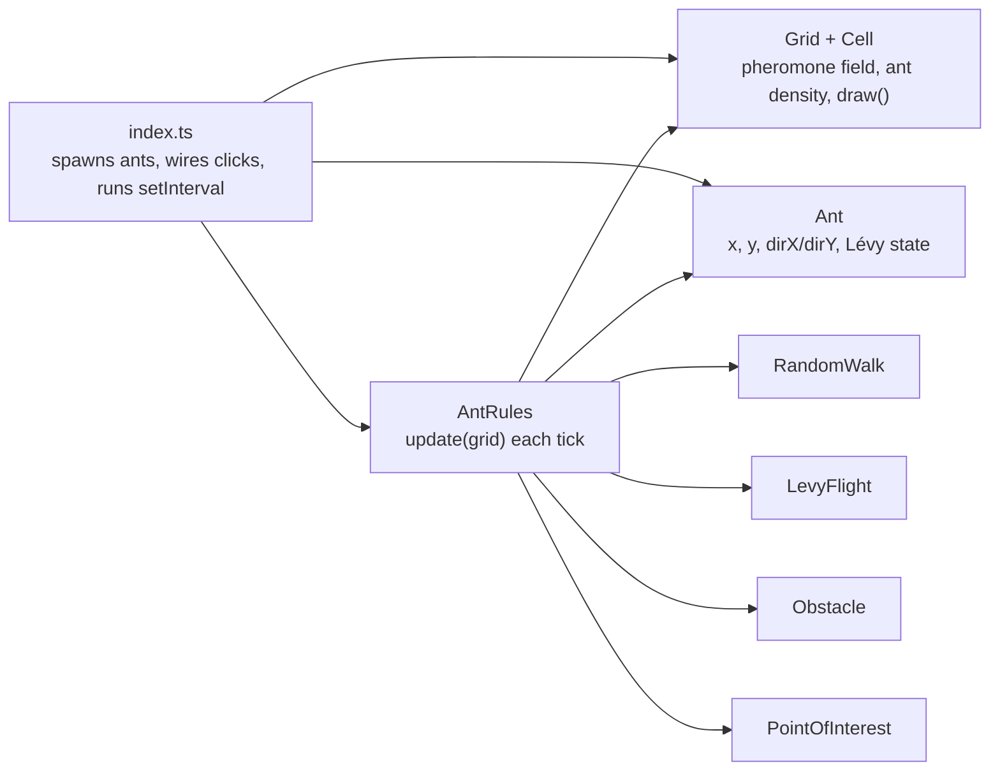

# automato

A TypeScript + Canvas ant-colony simulation. Ants forage toward a point of
interest, lay pheromone as they go, and — when an obstacle blocks the way —
can lock into the rotating **ant mill** ("death spiral") described in Li &
Chen's paper on memory-reinforcement systems.

## Running it

```
npm run dev      # start the Vite dev server
npm run build    # production build
npm run preview  # preview the production build
npm run format   # prettier --write src
```

Open the page, then:

- **Left-click** the canvas to drop a `PointOfInterest` (food).
- **Right-click** to drop a rectangular `Obstacle`.

There's no test suite or linter configured in this project.

## What happens on screen

Two hundred ants spawn in a corner of a 100×100 grid. Every 100ms the
simulation ticks: ants move, deposit pheromone, and the pheromone field
diffuses and evaporates across the grid. The same per-tick rule produces
different emergent behavior depending on what's on the grid:

1. **No goal yet** — ants explore via random walk and Lévy flights. No
   trail-following happens, so the spawn cluster can't collapse in on itself
   before you've placed anything.
2. **POI placed** — ants blend pheromone-gradient following with a pull
   toward the point of interest, converging on it.
3. **Path blocked** — an obstacle severs the direct route. Ants deflect
   along its edge instead of stopping.
4. **Mill forms** — memory (a persisted heading) plus reinforcement (the
   trail itself) can lock a subset of ants into a rotating loop around the
   obstacle.

## The paper, in two acts

This simulation is based on Li & Chen, ["Exploring the Ant Mill: Numerical
and Analytical Investigations of Mixed Memory-Reinforcement
Systems"](https://doi.org/10.48550/arXiv.1703.06859) (arXiv:1703.06859),
which studies the real death spiral some army ants fall into — following the
ant in front until the whole column drops from exhaustion. The paper gets
there in two attempts.

**Attempt 1 — rejected.** A density in position-*and*-velocity phase space,
ρ(x⃗, θ, t): track everything about every particle. The authors drop it on
two grounds — it demands storing a value for every position *and* velocity,
and the equation is linear, so it has no nontrivial solution. It cannot
produce a spiral at all.

**Attempt 2 — the one that works.** A continuum fluid model: density
ρ(x⃗, t) and pheromone g(x⃗, t) as fields over space, with a velocity field
advected by the pheromone gradient:

```
∂ρ/∂t + v·∇ρ = ∇·(∇ρ − ρ·[β/(α+βg)]·∇g)     density, reinforced by the trail
∂g/∂t = λρ − g                               pheromone: deposited, decays
∂v/∂t + v·∇v = b∇g                           velocity: steered by the gradient
```

Nonlinearity from the density-pheromone coupling is what finally lets an
axially-symmetric, time-independent *spiral* solution exist, and the paper
proves it numerically stable.

**Where this codebase sits.** This simulation keeps individual `Ant`
agents — the very thing the paper's first attempt was rejected for. What it
borrows is the *local force law* from the fluid model (the velocity
equation above) and applies it per-agent: each ant carries its own heading
and nudges it by the local pheromone gradient, rather than the codebase
solving a true velocity field. It's a Lagrangian approximation of a
Eulerian result — see [What's still approximate](#whats-still-approximate)
for what that costs.

## Architecture



```
src/
  index.ts              entry point: canvas setup, click handlers, the tick loop
  models/
    grid.ts             Grid: 2D array of Cell, draw()
    cell.ts             pheromone, ants
    ant.ts              per-agent state
    obstacle.ts         rectangle + contains() + draw()
    pointOfInterest.ts  a target point + draw()
  movement/
    movement.ts         Movement interface
    randomWalk.ts        uniform 4-direction step
    levyFlight.ts        heavy-tailed run length
  rules/
    antsRules.ts         the simulation — see below
```

`AntRules` is the only class that touches every other model. It's a good
starting point when reading the code.

### The grid & the cell

`Grid` owns a plain 2D array of `Cell` — the one piece of genuinely shared,
mutable state everything else reads and writes. `Grid.get(x, y)` is
bounds-checked and returns `undefined` off the edge, so every caller
(movement, pheromone diffusion) gets free boundary handling instead of
hand-rolled range checks.

```ts
export class Cell {
  public pheromone: number = 0; // trail concentration, decays/diffuses
  public ants: number = 0;      // how many ants are in this cell right now
  constructor(
    public readonly x: number,
    public readonly y: number,
  ) {}
}
```

The coordinate convention runs through the whole codebase: `x` is the row,
`y` is the column. `Grid.draw()` flips them for canvas pixels
(`pixelX = y*cellSize`, `pixelY = x*cellSize`), and every other `draw()`
method (obstacle, POI) repeats the same flip so everything lines up.

### The ant

An `Ant` is nothing but state — all the decision-making lives in
`AntRules`. Position stays plain integer grid cells; the one thing that
isn't discrete is `dirX`/`dirY`, a small persisted heading vector that's the
entire mechanism behind "memory."

```ts
export class Ant {
  public levyRemainingSteps = 0;
  public levyDirectionX = 0;
  public levyDirectionY = 0;

  // persisted heading (blends memory + reinforcement)
  public dirX: number;
  public dirY: number;

  constructor(public x: number, public y: number) {
    const angle = Math.random() * Math.PI * 2;
    this.dirX = Math.cos(angle);
    this.dirY = Math.sin(angle);
  }
}
```

`dirX`/`dirY` start as a random unit vector so an ant has *some* heading
before it ever follows a trail — otherwise the first blend in
`steerTowardTrail` would have nothing to persist.

### Movement strategies

A one-method interface, `move(x, y): [number, number]`, with two
implementations `AntRules` falls back to whenever an ant *isn't* actively
following a trail:

- **RandomWalk** picks one of four orthogonal directions uniformly. No
  state, no memory — the "just wander" case.
- **LevyFlight** commits to a random direction for a heavy-tailed number of
  steps, drawn from `length = random()^(-1/(μ-1))` and capped at
  `maxLength` (μ = 1.5, cap = 20). This is the classic Lévy-walk foraging
  pattern — long, straight, infrequent excursions mixed with local search —
  and it's an addition on top of the paper, which doesn't use Lévy flight
  at all.

### AntRules — the core loop

Four steps, every tick, over every cell and every ant:

```ts
update(grid: Grid): void {
  this.clearAntDensity(grid);   // zero cell.ants everywhere
  this.moveAnts(grid);          // decide + apply each ant's next cell
  this.depositPheromone(grid);  // cell.pheromone += λ · cell.ants
  this.diffusePheromone(grid);  // discrete Laplacian: spread + evaporate
}
```

`diffusePheromone` is a genuine finite-difference diffusion solver — for
every cell it computes the four-neighbor Laplacian and applies
`g += D·∇²g − evaporation·g`, clamped at zero. This is the one part of the
simulation that's a literal PDE integration, not an approximation of one.

**`moveAnts`** picks a step per ant, per tick, in priority order:

1. **Mid-Lévy-flight?** Keep going in the committed direction.
2. **Otherwise, if a POI exists** (80% of ticks): call `steerTowardTrail`
   (see below).
3. **Otherwise** (20% of ticks, or always when there's no POI yet): a 1%
   chance to start a fresh Lévy flight, else `RandomWalk`.

> **Why gate on "a POI exists"?** Two hundred ants spawn already clustered.
> If trail-following were active from tick zero, that cluster's own
> pheromone would be enough for the ants to lock into a mill around
> *themselves*, before anyone had placed a target. Restricting
> trail-following to "there's an actual goal to chase" keeps the opening
> seconds a plain, dispersing explore phase.

Whatever the source, the candidate move is rejected if it's off-grid or
inside an `Obstacle` — the ant simply stays put for that tick and still
gets counted into `cell.ants` at its current cell.

### `steerTowardTrail`, in detail

This one method is the entire ant-mill mechanism — the discrete, per-agent
stand-in for the paper's `∂v/∂t + v·∇v = b∇g`. It runs in three stages.

**1 — read the local pheromone gradient.** For each of the 8 neighboring
cells that isn't blocked or off-grid, add its offset direction weighted by
its pheromone concentration:

```ts
gradientX += unitX * cell.pheromone;
gradientY += unitY * cell.pheromone;
```

**2 — saturate it, don't just normalize it.** The raw sum's *magnitude* is
unbounded — it grows without limit wherever ants cluster, obstacle or not,
and would silently drown out the fixed-size pull toward the POI. Fully
normalizing to a unit vector fixes that but overcorrects: even a single
faint trace of pheromone then pulls at full strength, which glues every ant
into one rigid, indistinguishable block. The fix here is a saturating
curve:

```ts
const scale = gradientLength / (this.gradientSaturation + gradientLength);
gradientDirX = (gradientX / gradientLength) * scale;
gradientDirY = (gradientY / gradientLength) * scale;
```

— which sits near 0 for weak, noisy pheromone and only approaches 1 where a
trail is genuinely strong. It's a direct echo of the paper's own chemotaxis
coefficient, β/(α+βg), which saturates with concentration rather than
growing with it.

**3 — blend with memory, then pick a neighbor.** The gradient and the POI
direction are summed and re-normalized into one "signal" unit vector, then
blended with the ant's *existing* heading — addition, not replacement, is
what makes this memory rather than a fresh coin-flip every tick:

```ts
let dirX = this.memoryWeight * ant.dirX + (1 - this.memoryWeight) * signalX + noiseX;
let dirY = this.memoryWeight * ant.dirY + (1 - this.memoryWeight) * signalY + noiseY;
// normalize dirX, dirY back to unit length, store on ant.dirX/dirY

let best = candidates[0], bestScore = -Infinity;
for (const c of candidates) {
  const score = c.unitX * dirX + c.unitY * dirY; // dot product = alignment
  if (score > bestScore) { bestScore = score; best = c; }
}
return [best.x, best.y];
```

Because blocked neighbors were never added to `candidates`, an ant pressed
against an obstacle automatically steps into whichever *open* cell best
matches its heading — sliding tangentially along the wall instead of
stalling — which is the specific behavior that lets a queue of ants curve
into a loop instead of just piling up.

### Tunable constants

These constants are the entire knob set for whether a mill forms, how tight
it is, and how quickly ants find a POI. All live at the top of `AntRules`.

| Constant             | Value | Governs                                                          |
| --------------------- | ----- | ----------------------------------------------------------------- |
| `D`                   | 0.005 | Pheromone diffusion rate (the Laplacian term)                     |
| `evaporation`         | 0.05  | Per-tick pheromone decay                                          |
| `lambda`              | 0.2   | Pheromone deposited per ant occupying a cell                      |
| `poiWeight`           | 2.0   | Strength of the pull toward the nearest point of interest         |
| `gradientGain`        | 3.0   | Strength of the pull toward higher pheromone (the paper's *b*)    |
| `gradientSaturation`  | 0.1   | Pheromone level at which gradient influence half-saturates        |
| `directionNoise`      | 0.15  | Random perturbation added to heading each tick                    |
| `memoryWeight`        | 0.5   | How much the old heading outweighs this tick's signal             |

None of these are derived from the paper — it proves a spiral solution is
*stable* once it exists, not which parameters make one *form*. These values
were reached by running the simulation headlessly for thousands of ticks
and measuring outcomes (distance to POI, degrees rotated around an
obstacle), not by solving the paper's equations directly.

## What's still approximate

Worth stating plainly, since it shapes how far this simulation can be
pushed:

- The paper's spiral is a property of a *continuum field* — every point in
  space has a density and a velocity. This codebase gives each *ant* its
  own heading instead, updated by the same local rule. That's the
  individual-based style the paper's own Section 2 argues against; it's
  used here to keep this a cellular automaton with real per-ant agents, not
  to solve the PDEs directly.
- Because of that, a persistent, indefinitely-stable mill isn't guaranteed
  the way the paper's steady-state solution is — what actually happens is a
  handful of ants partially or fully circling an obstacle for a while, with
  real run-to-run variance.
- Every constant above was found empirically by running the sim headlessly
  and measuring outcomes, not derived from the paper's equations.
