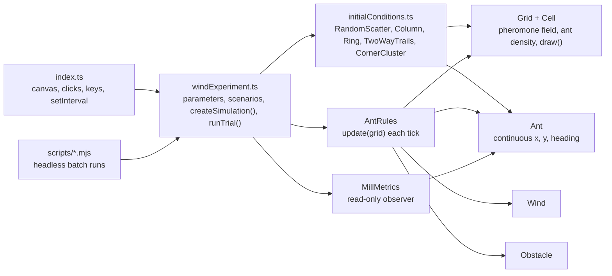

# automato

A TypeScript + Canvas simulation of blind army ants. Every ant walks at
constant speed, lays pheromone where it goes and steers toward the side of
its two antennae that smells more trail. Nothing else — no target, no
random-walk phases, no rule that mentions rotation — and yet, in a closed
arena, the ants merge into columns, the columns close into loops, and the
colony ends up in the rotating **ant mill** ("death spiral") described in Li
& Chen's paper on memory-reinforcement systems.

On top of that base movement sits an experiment asking whether **wind
blowing the pheromone trails around changes how mills form** — see
[The wind experiment](#the-wind-experiment).

## Running it

```
npm run dev         # start the Vite dev server
npm run build       # production build (no type checking)
npx tsc --noEmit    # type check
npm run preview     # preview the production build
npm run format      # prettier --write src
npm run movement    # headless tests of the base movement (see below)
npm run experiment  # headless batch runs of the wind experiment (see below)
npm run deploy      # build and publish the site to GitHub Pages (gh-pages branch)
```

Online: <https://mroliveiragit.github.io/Automato-ant-mill/> (simulation) and
<https://mroliveiragit.github.io/Automato-ant-mill/report> (report). They
update only when `npm run deploy` is run.

Open the page, then:

- `/?scenario=random|column|ring|trails|classic` picks the initial
  condition (default `random`, see [Scenarios](#scenarios)).
- **Right-click** to drop a rectangular `Obstacle`.
- **1 / 2 / 3 / 4** — restart from the same initial condition with no /
  weak / moderate / strong wind. **R** restarts without changing the wind.
  Obstacles you placed survive restarts, so every wind level is compared on
  the same layout.

`/report` shows the project report, in Brazilian Portuguese ([REPORT.md](REPORT.md)): commit
timeline, the maths and physics behind each part, and every result so far.

There's no test suite or linter configured in this project.

## What happens on screen

Two hundred ants in a 100×100 arena; every 100 ms the simulation ticks:
ants turn and step, deposit pheromone, and the pheromone field diffuses and
evaporates. Starting from ants scattered at random with no pheromone at all
(`random`):

1. **Trails** — within a hundred ticks, ants that cross each other's paths
   start following them, and the arena fills with winding single-file
   columns.
2. **Loops** — whenever a column's head runs into its own trail, the trail
   becomes a closed loop that every ant on it keeps reinforcing.
3. **Consolidation** — loops compete for ants; open trails and small loops
   evaporate while a few loops keep growing.
4. **Mill** — usually one large loop with most of the colony circling it,
   sometimes with a column still feeding into it. It persists for thousands
   of ticks.

## The paper, in two acts

This simulation is based on Li & Chen, ["Exploring the Ant Mill: Numerical
and Analytical Investigations of Mixed Memory-Reinforcement
Systems"](https://doi.org/10.48550/arXiv.1703.06859) (arXiv:1703.06859),
which studies the real death spiral some army ants fall into — following the
ant in front until the whole column drops from exhaustion. The paper gets
there in two attempts.

**Attempt 1 — rejected.** A density in position-*and*-velocity phase space,
ρ(x⃗, θ, t): track everything about every particle. The authors drop it on
two grounds — it demands storing a value for every position *and* velocity,
and the equation is linear, so it has no nontrivial solution. It cannot
produce a spiral at all.

**Attempt 2 — the one that works.** A continuum fluid model: density
ρ(x⃗, t) and pheromone g(x⃗, t) as fields over space, with a velocity field
advected by the pheromone gradient:

```
∂ρ/∂t + v·∇ρ = ∇·(∇ρ − ρ·[β/(α+βg)]·∇g)     density, reinforced by the trail
∂g/∂t = λρ − g                               pheromone: deposited, decays
∂v/∂t + v·∇v = b∇g                           velocity: steered by the gradient
```

Nonlinearity from the density-pheromone coupling is what finally lets an
axially-symmetric, time-independent *spiral* solution exist, and the paper
proves it numerically stable.

**Where this codebase sits.** This simulation keeps individual `Ant`
agents — the very thing the paper's first attempt was rejected for. What it
borrows is the *local force law* from the fluid model (the velocity
equation above) and applies it per-agent. With constant speed `s`, only the
part of `b∇g` perpendicular to the heading can change an ant's motion, so
the law becomes a turning rate

```
dθ/dt = (b/s) · (∇g · n̂)        n̂ = the ant's left-hand normal
```

and `∇g · n̂` is exactly what an ant measures by comparing its left and right
antennae. It's a Lagrangian approximation of a Eulerian result — see
[What's still approximate](#whats-still-approximate) for what that costs.

### What real army ants do, and why the movement is built this way

Army ants are nearly blind and navigate by pheromone alone. They are almost
always walking and rarely reverse. No individual knows where food or the
nest is: each ant follows the trail laid by the ants ahead and lays trail
itself as it walks. A mill (Beebe 1921; Schneirla 1944) happens when a group
loses the main trail and the head of its column runs into its own tail —
the closed loop then sustains itself because every ant keeps doing exactly
what it always does.

So the base movement is those rules and nothing more. An earlier version
had ants wander (random walk + Lévy flights) until a point of interest was
placed and then head for it; with a point attractor every heading points
inward rather than along a loop, and no mill formed in any configuration.
Those mechanisms were removed rather than kept as options — they're in the
git history if a foraging layer is ever added back.

## Architecture



```
src/
  index.ts                  entry point: canvas, click/key handlers, HUD, the tick loop
  models/
    grid.ts                 Grid: 2D array of Cell, draw() (canvas optional, for headless runs)
    cell.ts                 pheromone, ants
    ant.ts                  continuous position + heading
    obstacle.ts             rectangle + contains() + draw()
    wind.ts                 wind direction + strength → velocity
  rules/
    antsRules.ts            the simulation — see below
  simulation/
    initialConditions.ts    the scenarios' initial conditions
    windExperiment.ts       all parameters, scenarios, createSimulation(), batch trials
    millMetrics.ts          ant-mill detector (observes, never steers)
    experimentOverlay.ts    wind arrow, A/B markers, mill marker
scripts/
  common.mjs                argument parsing, statistics, Vite SSR loading
  movement-tests.mjs        npm run movement
  wind-experiment.mjs       npm run experiment
```

### The grid, the cell and the ant

`Grid` owns a plain 2D array of `Cell` — the pheromone field and the
per-cell ant count. `Grid.get(x, y)` is bounds-checked and returns
`undefined` off the edge. The coordinate convention runs through the whole
codebase: `x` is the row, `y` is the column, and every `draw()` flips them
for canvas pixels (`pixelX = y*cellSize`, `pixelY = x*cellSize`).

Ants are **not** on the lattice. An `Ant` has a continuous position `x, y`
(in cells; it occupies cell `floor(x), floor(y)`) and a continuous `heading`
in radians. The heading is the ant's entire memory: it only changes through
the turn and the noise of each tick. The grid is still a cellular automaton
for the chemistry; continuous positions are what let ants trace smooth
curves, and therefore rings, instead of 8-direction staircases.

### AntRules — the core loop

Four steps, every tick:

```ts
update(grid: Grid): void {
  this.clearAntDensity(grid);   // zero cell.ants everywhere
  this.moveAnts(grid);          // sense, turn, step
  this.depositPheromone(grid);  // cell.pheromone += deposit · cell.ants
  this.diffusePheromone(grid);  // diffusion + wind advection + evaporation
}
```

**`moveAnts`**, for every ant:

1. **Sense.** Two antennae sit `sensorDistance` cells ahead at
   `±sensorAngle` from the heading. Each reads the pheromone there,
   interpolated bilinearly between cell centres (without it the difference
   jumps in steps whenever an antenna crosses a cell border). Nothing behind
   the ant is sensed — its own fresh trail can't pull it backward.
2. **Turn.**

   ```ts
   const pull = (turnGain * (left - right)) / (turnSaturation + left + right);
   const turn = clamp(pull, -maxTurn, maxTurn);
   ant.heading += turn + turnNoise * gaussian();
   ```

   The turn is *proportional* to the difference: a faint trail bends the
   path a little and a strong one a lot, which is what lets heading
   persistence and the trail's sideways pull balance on a ring. The
   denominator is the paper's saturating `β/(α+βg)`: below
   `turnSaturation` a difference counts for little, so trace pheromone is
   treated as noise.
3. **Step** `speed` cells along the new heading. Ants never stop. Grid walls
   and obstacles are axis-aligned rectangles, so a collision is a specular
   reflection: the heading component that would cross the wall is flipped.
   Ants bounce off walls rather than sliding along them, so nothing drags
   them into loops around an obstacle or the arena.

The rule is symmetric between left and right, so nothing favours either
sense of rotation — a mill has to come from a trail that happens to close.

`diffusePheromone` is a genuine finite-difference solver — for every cell it
computes the four-neighbour Laplacian and the upwind wind term and applies
`g += D·∇²g − v_wind·∇g − evaporation·g`, clamped at zero (see
[Numerics](#numerics)).

### Tunable constants

All in `DEFAULT_ANT_RULES` (`src/rules/antsRules.ts`); `createSimulation`
and both runners accept overrides.

| Setting          | Default | Governs                                                           |
| ---------------- | ------- | ----------------------------------------------------------------- |
| `diffusion`      | 0.005   | Pheromone diffusion rate `D` (the Laplacian term)                 |
| `evaporation`    | 0.05    | Per-tick pheromone decay `μ`                                      |
| `deposit`        | 0.2     | Pheromone laid per ant per tick (`λ`)                             |
| `speed`          | 1       | Walking speed, cells/tick                                         |
| `sensorDistance` | 3       | How far ahead the antennae reach (cells)                          |
| `sensorAngle`    | π/4     | Antenna angle either side of the heading                          |
| `turnGain`       | 1       | `b`: turn per unit of normalized left–right difference (rad)      |
| `turnSaturation` | 0.05    | `α`: pheromone level below which differences count for little     |
| `maxTurn`        | 0.5     | Largest deterministic turn per tick (rad); min. radius `speed/maxTurn` |
| `turnNoise`      | 0.1     | Standard deviation of the angular noise per tick (rad)            |

These are not derived from the paper, which proves a spiral is *stable* once
it exists, not which parameters make one *form*. They were chosen by
reasoning (e.g. a ring of radius `R` needs `maxTurn ≥ speed/R`) and checked
by the sweeps below.

### Scenarios

| Scenario  | Initial condition                                                         | Used for |
| --------- | ------------------------------------------------------------------------- | -------- |
| `random`  | Ants uniform over the arena, random headings, no pheromone                | Neutral test: do trails and mills emerge? |
| `column`  | One pheromone trail from A to B with every ant on it heading toward B      | Test B: a column that loses its trail |
| `ring`    | A pheromone ring (radius 15) with ants on it heading along the tangent     | Test A: can the rules sustain a mill? |
| `trails`  | Two counter-flowing lanes A→B / B→A                                        | Wind experiment |
| `classic` | Ants clustered in a corner, no pheromone                                   | The original setup |

Headings seeded along a ring or lane are initial condition only; from tick 1
every ant runs the same symmetric rule. Placement uses a seeded PRNG
(`mulberry32`), so a given seed always starts from the same state; the
dynamics stay stochastic (`Math.random`).

### Testing the base movement

```
npm run movement -- --scenario ring   --runs 10               # Test A
npm run movement -- --scenario random --runs 20 --ticks 3000  # Test B
npm run movement -- --scenario random --runs 10 --ticks 3000 \
  --sweep turnGain=0.5,1,2 --sweep turnNoise=0.05,0.1,0.2,0.3 # robustness
```

`--set key=value` fixes a setting, `--sweep key=v1,v2,…` sweeps it (several
sweeps make a grid), `--wind S` adds wind, `--layout` adds obstacles,
`--json` dumps per-run data. Every row uses the same seeds. Besides the mill
columns (see [Detecting a mill](#detecting-a-mill)), the table reports, over
the last quarter of each run, the fraction of ticks still rotating, the
fraction of ants **following** (another ant within 3 cells ahead, heading
the same way — single-file columns) and the fraction **crowded** (in cells
holding ≥ 4 ants — clumps).

Results with the defaults, no wind, no obstacles:

- **Test A (ring, 10 × 2000 ticks):** the seeded mill survives in 10/10
  runs, rotating for 100% of the last quarter with all 200 ants
  participating (≈ 28 rotations). ("Crowded" is high here, ~50%, only
  because 200 ants share a 94-cell ring.)
- **Test B (random, 10 × 3000 ticks):** a mill forms in 10/10 runs, first
  rotation after 510 ± 126 ticks, 73% of ants in columns at the end.
  **(column):** 10/10, after 211 ± 36 ticks.
- **Robustness:** mills form in 8–9 of 10 runs for every `turnGain` in
  {0.5, 1, 2} with `turnNoise` ≤ 0.2. At `turnNoise` = 0.3 trail-following
  breaks down (11–39% of ants in columns) and mills drop to 0–5 of 10 — the
  noise level is the clearest control parameter for mill formation.

## The wind experiment

**Question: can wind-induced disruption of pheromone trails favor the
spontaneous emergence of an ant mill?**

Wind here is an external perturbation of the *pheromone field only*. Ants
are never pushed by it, never told to rotate, and no rule mentions
obstacles, mills or the wind direction. The only way the wind reaches an
ant is through the values of `Cell.pheromone` its antennae read. If
rotation appears, it has to come out of this chain:

```
wind → advection of g → displaced/distorted trails → changed local gradient
     → changed trajectories → new deposition → memory ⇄ pheromone feedback
     → (maybe) collective circulation
```

### The pheromone equation with wind

The pheromone field was `∂g/∂t = D∇²g + λρ − μg`. The experiment adds an
advection term for a uniform wind velocity `v_wind`:

```
∂g/∂t = D∇²g − v_wind·∇g + λρ − μg
```

`g` is pheromone, `D` diffusion, `λρ` deposition by ants, `μg` evaporation
(`μ` is `evaporation` in the code). This is an extension of *this
codebase's* pheromone model. It is not the full Li & Chen continuum model.
Ants are still individual agents with their own heading, sharing one
pheromone field that now has diffusion, evaporation, deposition and
wind-driven transport.

### Numerics

`diffusePheromone` integrates the equation with explicit Euler
(`dt` = 1 tick, `dx` = 1 cell). The advection term uses **first-order
upwind** differences: along each axis, the derivative is taken from the
side the wind comes from, so for wind `v = (vx, vy)`

```
g' = g + D·L(g) − μ·g − |vx|·(g − g_upwind_x) − |vy|·(g − g_upwind_y)
```

Central differences would be simpler, but with explicit Euler they're
unconditionally unstable for advection and produce negative
concentrations.

- **Stability and positivity.** Every coefficient of the update is
  non-negative as long as `|vx| + |vy| + 4D + μ ≤ 1`. The new value is then
  a weighted average of old values, so `g` can't go negative or blow up.
  With `D = 0.005` and `μ = 0.05`, that allows `|vx| + |vy| ≤ 0.93`
  cells/tick. `AntRules.advectionVelocity()` scales any stronger wind down
  to that limit, keeping its direction. Setting any wind strength can't
  destabilize the run: 3000-step stress tests with random deposits stay
  finite and ≥ 0, even for requested strengths of 10⁶.
- **No wind = no advection.** With `v = 0` the update is bit-for-bit the
  diffusion-only solver.
- **Boundaries.** Diffusion keeps its zero-flux edges. For the wind, clean
  air (g = 0) enters across the upwind edge and pheromone leaves freely
  across the downwind edge. Mass is otherwise conserved. Over 20 ticks, a
  blob loses exactly the evaporation factor `0.95²⁰`.
- **Obstacles don't block the wind**, just as they already don't block
  diffusion. The wind is uniform; there is no flow around obstacles and no
  sheltered wake behind them.
- **Drift speed.** Because evaporation and advection happen in the same
  explicit step, a pheromone blob's centroid moves `v/(1 − μ) ≈ 1.05·v`
  cells per tick, not exactly `v` (a first-order time-step effect).
- **Numerical diffusion.** First-order upwind smears the field along the
  wind direction with an extra diffusivity of about `|v|(1 − |v|)/2`. That's
  0.024 (weak), 0.064 (moderate) and 0.12 (strong), against a physical
  `D = 0.005`. Some of the "disruption" at stronger winds is therefore
  numerical smearing on top of real transport — see
  [What's still approximate](#whats-still-approximate).

### Controlled initial trails

`TwoWayTrails` (in `initialConditions.ts`) seeds two parallel lanes of
pheromone between points **A** and **B**. The A→B lane sits on the top side
of the segment and the B→A lane on the bottom:

```
A =====================> B      lane 1, ants start heading toward B
A <===================== B      lane 2, ants start heading toward A
```

Each lane has concentration `trailStrength` on its axis, falling linearly
to zero `trailWidth + 1` cells away. `Cell.pheromone` is a scalar, so a lane
has no direction of its own. "A→B" versus "B→A" exists only in the ants'
initial `heading` (their memory), with half the ants on each
lane plus a small random angular jitter. All of this is initial condition,
not behavior. From tick 1 the ants run the normal model. They
reinforce the lanes or abandon them, and an unreinforced lane evaporates
within a few seconds. Placement uses a seeded PRNG (`mulberry32`), so every
wind level starts from exactly the same state for a given seed. The
dynamics stay stochastic (`Math.random`).

### Parameters

All in `src/simulation/windExperiment.ts`:

| Parameter                     | Default          | Meaning                                                             |
| ----------------------------- | ---------------- | ------------------------------------------------------------------- |
| `WIND_PRESETS[].strength`     | 0 / 0.05 / 0.15 / 0.4 | Wind speed (cells/tick): none / weak / moderate / strong      |
| `windDirection`               | `[1, 0]`         | Direction (row, col); `[1, 0]` is a crosswind, perpendicular to A–B |
| `trails.pointA/pointB`        | (50,20) / (50,80)| Lane endpoints (row, col)                                            |
| `trails.trailDistance`        | 6                | Distance between the axes of the two lanes                           |
| `trails.trailStrength`        | 5                | Pheromone on each lane's axis                                        |
| `trails.trailWidth`           | 1                | Half-width of each lane (cells)                                      |
| `trails.headingJitter`        | 0.3              | Max deviation (rad) of the initial heading from the lane direction   |
| `layout`                      | `"none"`         | Obstacle layout: `none`, `gap` (between lanes), `block` (across both)|
| `ring`, `column`              |                  | Geometry of the Test A / Test B initial conditions                   |
| `numberOfAnts`, `seed`        | 200, 1           |                                                                      |
| `ticksPerRun`, `minRotations` | 2000, 1          | Batch run length; rotations needed to count a run as "mill formed"   |

The presets are spaced by the distance pheromone travels during its
lifetime, `strength / μ`: about 1 cell (weak), 3 cells (moderate, half the
lane separation) and 8 cells (strong, more than the lane separation). The
most informative things to vary are the wind **strength**, the wind
**direction** relative to the lanes (crosswind displaces them, a wind along
A–B stretches them), the **lane separation** relative to `strength / μ`, and
the **obstacle layout**. Don't assume the response is monotonic.

### Detecting a mill

`MillMetrics` watches ant positions and never feeds back into the
simulation. The obvious rotation order parameter, the mean of `r̂ × v̂`
around a centre, is not enough on its own here. Two counter-flowing
straight lanes — this experiment's own starting condition — already score
high on it without anyone going round in circles. So the detector works in
two steps:

1. **Which ants are actually looping?** Each ant's direction is the
   direction of its net displacement over the last 5 ticks. The detector
   accumulates how far that direction turns within an exponential window of
   300 ticks. An ant is *looping* when that turning reaches a full `2π` and
   at least 30% of all its turning was in that one direction. Abrupt
   reversals (more than 60° in a tick) are ignored rather than counted as
   ±π.
2. **Are they circling together?** Take the looping ants in the dominant
   sense (the *participants*) and their centroid. The state is **rotating**
   when there are ≥ 15 participants and ≥ 80% of them have angular momentum
   around that shared centroid in the loop's own sense (*alignment*).
   Independent loops scattered across the grid sit around 50%.

Reported each tick (HUD) and per run (`npm run experiment`):

- participants
- sense
- centroid and mean radius
- alignment
- the classic rotation order parameter `|⟨r̂ × v̂⟩|`
- angular velocity: how fast participants' headings turn, i.e. `2π` per
  lap for any loop shape
- rotating episode length and completed rotations
- fraction of time rotating
- longest episode
- fraction of ants within 2 cells of the grid edge

A run counts as **"mill formed"** when some episode completes
`minRotations` (1) full rotations.

The thresholds were calibrated against synthetic ground truth mixed with
random walkers:

- **Detected:** circular mills of 15–40 ants with radius 4–15, a mill
  drifting at 0.03 cells/tick, a clump chasing round a ring, and a racetrack
  loop around both lanes. Participant counts come out exact, for example
  40/40 at radius 7.7 for a true radius of 8.
- **Never flagged:** counter-flowing lanes that bounce at their ends,
  scattered independent loops (mixed or same sense), and pure random
  walkers.
- **Partial:** mills with radius ≥ 20 are only partly detected. A
  sustained non-rotating clump is correctly *not* reported as a mill.

The calibration predates the current movement rule. With it, typical mills
have a mean radius of 12–28 cells and are detected; the `random` scenario
also produces occasional tight balls circling at radius ~4, which count as
mills too. The runners report the mean mill radius and the share of
rotating time spent touching a wall, so both can be checked.

### Running comparisons

The simulation is stochastic, so compare many runs, not one:

```
npm run experiment -- --runs 20 --ticks 2000 --layout gap
npm run experiment -- --scenario random --runs 20 --ticks 3000   # mills from scratch
node scripts/wind-experiment.mjs --runs 20 --json > results.json   # per-run data
```

`--scenario` defaults to `trails`; `--set key=value` overrides a movement
setting as in `npm run movement`.

Every wind level uses the same seeds (`seed … seed + runs − 1`), so the
comparison is paired: identical initial conditions, independent dynamics.
The table reports how many runs formed a mill, with a 95% Wilson interval,
plus mean ± standard error of the other metrics. It also shows the
min/max pheromone seen, as a numerical sanity check. The runner loads the
TypeScript directly through Vite's SSR loader, so it needs no extra
dependencies or build step.

### Results with the army-ant movement

Crosswind `[1, 0]` (downward on screen), no obstacles, paired seeds. "Lost /
gained" counts the seeds whose mill outcome flipped relative to no wind;
*p* is an exact McNemar test on those pairs. "Wall mill" is the share of
rotating time during which the mill (centroid ± mean radius) comes within
3 cells of an arena wall. Mean ± standard error.

**E1 — does wind destroy an existing mill?** (`ring`, 20 runs × 2000 ticks)

| Wind     | Mill (≥ 1 rotation) | Rotating, last quarter | Rotations  | Ants near walls |
| -------- | ------------------- | ---------------------- | ---------- | --------------- |
| none     | 20/20               | 100%                   | 27.6       | 0%              |
| weak     | 20/20               | 43 ± 7%                | 14.3       | 10%             |
| moderate | 20/20               | 33 ± 5%                | 4.2        | 15%             |
| strong   | 5/20 (p < 0.001)    | 6 ± 3%                 | 0.7        | 19%             |

Wind wears a mill down monotonically: the seeded ring is carried downwind,
deforms and breaks up; strong wind destroys it within a few hundred ticks.

**E2 — emergence at the default settings** (`random`, 40 runs × 3000 ticks)

| Wind     | Mills  | Lost / gained, p | Rotating % of ticks (paired Δ) | Mill radius | Wall mill |
| -------- | ------ | ---------------- | ------------------------------ | ----------- | --------- |
| none     | 33/40  |                  | 46 ± 4                         | 23 ± 1      | 42 ± 5%   |
| weak     | 39/40  | 1 / 7, 0.07      | 45 ± 2 (−1 ± 5)                | 15 ± 0.4    | 61 ± 3%   |
| moderate | 37/40  | 3 / 7, 0.34      | 30 ± 2 (−16 ± 5)               | 13 ± 0.5    | 58 ± 2%   |
| strong   | 10/40  | 27 / 4, < 0.001  | 9 ± 1 (−37 ± 4)                | 12 ± 0.6    | 62 ± 2%   |

**E3 — emergence where mills are rare** (`random`, `turnNoise` = 0.3, 40
runs × 3000 ticks)

| Wind     | Mills  | Lost / gained, p | Rotating % of ticks (paired Δ) | Mill radius | Wall mill |
| -------- | ------ | ---------------- | ------------------------------ | ----------- | --------- |
| none     | 21/40  |                  | 23 ± 4                         | 22 ± 1.5    | 38 ± 5%   |
| weak     | 29/40  | 4 / 12, 0.08     | 19 ± 2 (−4 ± 4)                | 16 ± 0.6    | 71 ± 4%   |
| moderate | 16/40  | 12 / 7, 0.36     | 6 ± 1 (−16 ± 4)                | 16 ± 1.0    | 75 ± 4%   |
| strong   | 0/40   | 21 / 0, < 0.001  | 0.3 ± 0.1 (−22 ± 4)            | 28 ± 1.1    | 90 ± 5%   |

What this does and doesn't show:

- **Strong wind suppresses mills** in every setting, and moderate wind cuts
  the time spent rotating by about a third to two thirds.
- **Weak wind makes a mill episode more likely** — in both E2 and E3, and
  pooled over both (5 lost / 19 gained) *p* ≈ 0.007. But those mills are
  smaller (radius ~15 instead of ~23) and shorter-lived, and the total time
  spent rotating doesn't increase. Wind produces *more, briefer, smaller*
  mills, not more milling.
- **The arena walls are involved in most of it.** Even without wind, mills
  of radius ~23 in a 100-cell arena touch a wall during ~40% of their
  rotating time; under wind that rises to 60–90%, with the colony pushed
  against the downwind wall. So the weak-wind increase can't yet be
  attributed to wind acting on trails rather than to loops pinned against
  the downwind wall. Separating the two needs an arena without walls
  (periodic boundaries) or one much larger than a mill.

## What's still approximate

Worth stating plainly, since it shapes how far this simulation can be
pushed:

- The paper's spiral is a property of a *continuum field* — every point in
  space has a density and a velocity. This codebase gives each *ant* its
  own heading instead, updated by the same local rule. That's the
  individual-based style the paper's own Section 2 argues against; it's
  used here to keep this a cellular automaton with real per-ant agents, not
  to solve the PDEs directly.
- Because of that, a persistent mill isn't guaranteed the way the paper's
  steady-state solution is: mills form, merge and occasionally break up,
  with real run-to-run variance.
- Every constant above was chosen by reasoning plus headless sweeps, not
  derived from the paper's equations.
- The arena is a closed box with reflecting walls and the ants are an
  isolated group with nowhere to go — the situation real mills occur in,
  but it makes mills common (≈ 80–90% of runs). The arena is also small
  for the mills it produces: even without wind, a mill touches a wall
  during ~40% of its rotating time. The minimum turning radius `speed/maxTurn` = 2 cells
  allows tight balls of circling ants that are smaller than real mills.
- Ants don't exclude each other: any number can share a cell.

For the wind experiment specifically:

- **The arena is bounded, and a steady wind carries the whole trail system
  downwind.** With the current movement 15–20% of ants sit within 2 cells
  of a wall under wind, against ~1% without, and 60–90% of windy mill time
  is spent touching a wall (see the results above). An ant on a trail
  senses more pheromone downwind, because the plume streams that way. It follows that
  gradient, deposits there, and repeats. Ants plus pheromone therefore drift
  downwind until they reach the wall (with the earlier movement rule most
  of the colony ended pressed against it after roughly `50 / v` ticks).
  This transport is an
  emergent result, but the wall it ends at is an artifact. Watch
  `% ants near walls` before interpreting anything late in a windy run.
- Before reaching the wall, a crosswind breaks the two continuous lanes up
  into separate drifting clusters of ants.
- The wind is uniform and passes straight through obstacles. There's no
  flow field, no sheltered wake and no gusts.
- First-order upwind adds numerical diffusion along the wind that is 5–24×
  the physical `D` at the preset strengths. To separate transport from
  smearing, compare against a run that adds the same extra isotropic
  diffusion without wind, or switch to a less diffusive scheme (for
  example a flux-limited second-order one).
- The mill detector is a heuristic with calibrated thresholds, not a
  proof. It under-detects very large loops (radius ≥ 20) within the
  300-tick window, and it needs at least 15 participants, so a "handful of
  ants" circling an obstacle doesn't count.
